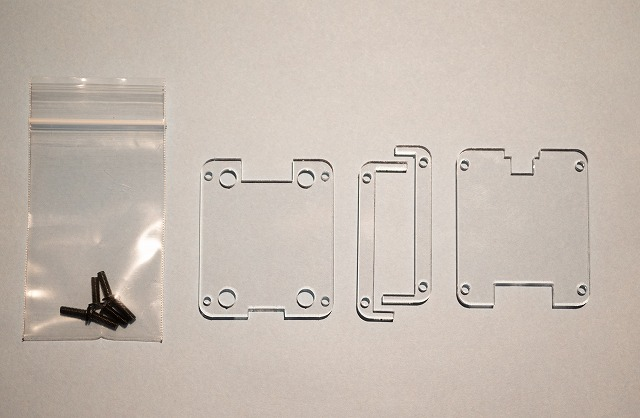
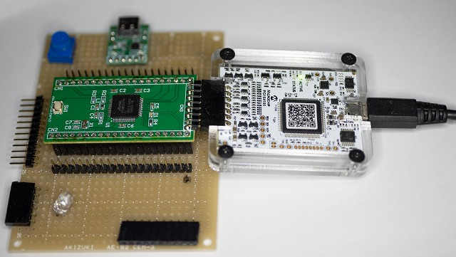

# AN-220 MPLAB SNAP用アクリルケース

# 商品説明

Microchip社の低価格ライターである「MPLAB SNAP」にアクリルケースを被せる非公式オプションパーツです。

「MPLAB SNAP」PICシリーズの書き込みやデバックは勿論、旧Atmel社AVRや最新ARMコアのATSAMシリーズにまで対応しております。

ケースが無い為低価格であったSNAPにピッタリなアクリルケースを作成しました。

 
# 仕様

-   目的：MPLAB SNAPを保護するため
-   アクリル厚み：3mm厚　x3枚　
-   パーツ数：4パーツ
-   ネジ：3mm x4

# 内容物

- アクリル：4パーツ
- ネジ：3mm x4(余分を入れてます)
 
# 使用例

# 資料（箇条書き、必須）
- SNAP本体　https://www.microchip.com/en-us/development-tool/PG164100
- 秋月電子通商　https://akizukidenshi.com/catalog/g/gM-13854

# 組み立て方法

